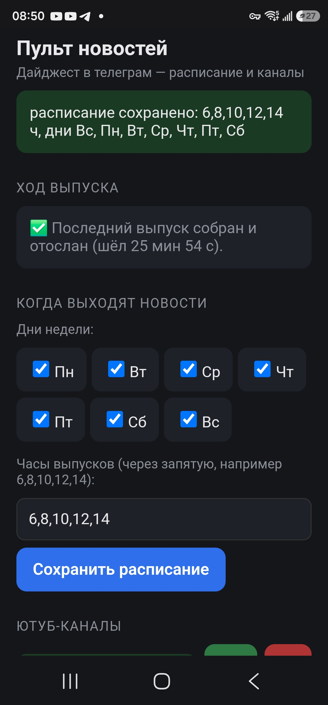
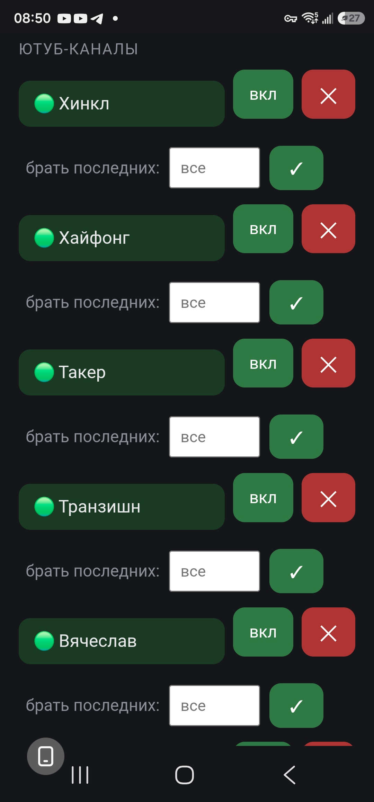
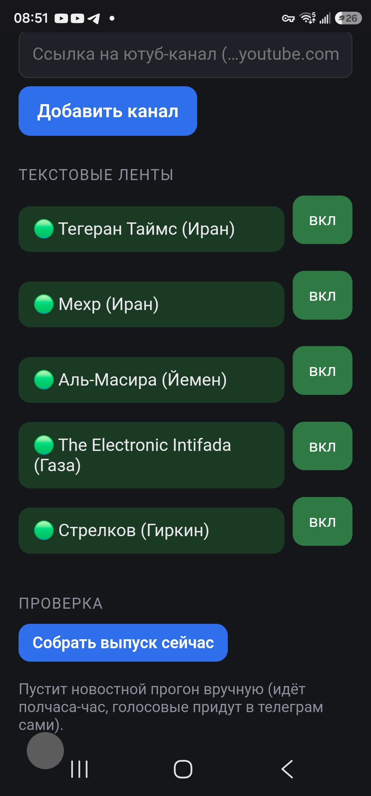

# TruckerNews

**Голосовой дайджест новостей для водителей-дальнобойщиков.**
*A hands-free voice news digest for long-haul truckers.*

Свежие новости приходят готовой озвучкой в Telegram — слушай в дороге, не
отрываясь от руля. Никакого поиска, листания и чтения за рулём.

*Fresh news arrives as ready-to-play voice messages in Telegram — listen on
the road without taking your eyes off it. No searching, no scrolling, no
reading while driving.*

---

## Зачем это / Why

Водитель-дальнобойщик за рулём не может искать новости, листать ленты и
читать статьи — это опасно и отнимает время. TruckerNews делает всё за него:
сам обходит десятки источников, отбрасывает повторы и присылает короткую
голосовую сводку в Telegram. Руки на руле, глаза на дороге.

*Придумано и обкатано дальнобойщиком — для дальнобойщиков.*

## Что умеет / Features

- 📰 **Много источников сразу** — ютуб-обозреватели и текстовые новостные
  ленты собираются в один выпуск.
- 🔁 **Без повторов** — одно событие звучит **один раз**, собранное из всех
  источников, а не по пять раз с разных каналов. Модель размечает каждую
  новость темой, сливает рассказы об одном событии и пишет по нему один
  связный пересказ.
- 🔊 **Играет само, без касаний.** Готовые голосовые сообщения приходят в
  Telegram и проигрываются **подряд, одно за другим** — не надо тыкать
  пальцем в каждое. Включил и слушаешь весь выпуск, руки на руле.
  (Технически: отправка через `sendVoice`, а не файлами — телеграм ставит
  их в единую очередь воспроизведения.)
- ✍️ **Безупречный русский язык.** Пересказ делает русская модель **T-Pro**,
  которую при сжатии в 4 бита (чтобы уместилась в одну видеокарту)
  **откалибровали на произведениях А. С. Пушкина** — эталоне русской речи.
  Благодаря этому сжатая модель говорит чище исходной: грамотный, живой
  русский, без ошибок и без чужих слов, которыми грешат обычные модели.
  Эта сжатая модель выложена в открытый доступ:
  **[Youri2/T-pro-it-1.0-int4-W4A16](https://huggingface.co/Youri2/T-pro-it-1.0-int4-W4A16)**
  на Hugging Face — можно взять готовую.
- 🎛 **Настройка с телефона на лету** — простой веб-пульт прямо из кабины:
  - добавляй и убирай ютуб-каналы одним касанием;
  - включай и выключай новостные ленты, какие надоели;
  - задавай для каждого канала, сколько последних выпусков брать;
  - меняй дни и часы выхода новостей;
  - следи за ходом сборки — прогресс-бар и прогноз времени.
- 🌍 **Двуязычный (en-ru)** — берёт и англо-, и русскоязычные источники,
  пересказ на русском.

## Как выглядит пульт / Screenshots

Всё управление — с телефона, прямо из кабины:

<p align="center">
  
  &nbsp;
  
  &nbsp;
  
</p>

Слева направо: **расписание выпусков** (дни и часы) и монитор **хода
сборки** («последний выпуск собран, шёл 25 мин»); список **ютуб-каналов**
— включить/выключить, удалить, задать «брать последних N»; **текстовые
ленты** и кнопка **«Собрать выпуск сейчас»**.

## Как это устроено / How it works

```
источники ──▶ скачивание+расшифровка (ютуб) / загрузка статей (ленты)
                         │
                         ▼
             пересказ каждого куска  ──▶  модель T-Pro (локальный vLLM)
                         │
                         ▼
   сведение по событиям:  тема каждому  ▶  группировка «одно событие»
                                          ▶  один рассказ из всех источников
                         │
                         ▼
             озвучка (Fish Speech TTS)  ──▶  Telegram (sendVoice)
```

Выпуск строится **по событиям**, а не по каналам:
1. каждой новости модель вешает короткую тему;
2. новости об одном событии сходятся в группу, важное — вперёд;
3. на каждую группу — один связный рассказ из всех источников сразу.

Так одно событие звучит один раз, а не повторяется по каждому каналу.

## Требования к железу / Hardware

Проект рассчитан на самостоятельный хостинг с локальной видеокартой —
всё крутится на твоём компьютере, без облака.

- 🖥 **Видеокарта NVIDIA — главное требование.** Модель пересказа T-Pro в
  4 битах занимает ~18 ГБ видеопамяти, плюс расшифровка роликов (Whisper)
  на той же карте — вместе примерно **24–27 ГБ**. Практичный минимум —
  **видеокарта с 24 ГБ** (RTX 3090 / 4090). Оригинал собран на
  **RTX 5090 (32 ГБ)**. На карте поменьше — бери модель пересказа полегче
  или веди расшифровку роликов на процессоре (медленнее).
- 🧠 **Оперативная память:** от 16 ГБ (комфортно — 32 ГБ).
- 💾 **Диск:** ~20 ГБ под модель (int4) плюс место под временные аудио.
- ⚙️ **Процессор:** любой современный; если расшифровка идёт на нём —
  чем мощнее, тем быстрее.
- 🐧 **ОС:** Linux (обкатано на Ubuntu). Python 3.11+.
- 🌐 **Интернет** — для источников новостей и Telegram.

*Без мощной видеокарты тоже можно — если взять модель пересказа и
расшифровку полегче или запускать на процессоре, — но выпуск будет
собираться заметно дольше.*

## Что нужно для запуска / Requirements

Это **референсная реализация под самостоятельный хостинг** — она рассчитана
на свои локальные сервисы, а не на облако. Чтобы поднять у себя, понадобятся:

- **Python 3.11+** (только стандартная библиотека для самих скриптов).
- **Модель пересказа** с OpenAI-совместимым API. В оригинале —
  **[T-Pro-it-1.0, сжатая в int4 (калибровка на Пушкине)](https://huggingface.co/Youri2/T-pro-it-1.0-int4-W4A16)**,
  запущенная через [vLLM](https://github.com/vllm-project/vllm). Модель
  выложена и готова к скачиванию. Подойдёт и любая другая с хорошим
  русским — адрес задаётся в настройках.
- **Синтез речи (TTS)** — в оригинале [Fish Speech](https://github.com/fishaudio/fish-speech);
  можно заменить на любой, что отдаёт голосовой файл.
- **[yt-dlp](https://github.com/yt-dlp/yt-dlp)** — скачивание аудио с ютуба.
- **[faster-whisper](https://github.com/SYSTRAN/faster-whisper) / transformers Whisper** — расшифровка роликов.
- **Telegram-бот** — создать у [@BotFather](https://t.me/BotFather), взять токен.

Проект вырос из личной установки автора (одна рабочая станция + одна
видеокарта), поэтому пути и адреса сервисов вынесены в настройки — подгони
под свою машину.

## Настройка / Setup

1. Скопируй примеры настроек и впиши свои значения:
   ```bash
   cp config.example.json config.json
   cp telegram.example.json telegram.json
   ```
   - `telegram.json` — токен твоего бота и chat_id (**никому не показывай**).
   - `config.json` — список ютуб-каналов и включённые ленты.
2. Укажи адреса своих сервисов (модель пересказа, TTS) в начале
   `digest-news-en-ru.py`.
3. Запусти сборку выпуска вручную для проверки:
   ```bash
   python3 digest-news-en-ru.py
   ```
4. Поставь на расписание (cron) и/или подними веб-пульт:
   ```bash
   python3 remote-news.py     # веб-пульт настроек, по умолчанию порт 8091
   ```

## Безопасность / Security

- **Токен Telegram-бота — секрет.** Не коммить `telegram.json` (он в
  `.gitignore`). По токену чужой человек сможет писать от имени твоего бота.
- Веб-пульт не имеет авторизации — держи его только в закрытой личной сети
  (например, [Tailscale](https://tailscale.com)), **не** открывай в интернет.

## Лицензия / License

[MIT](LICENSE) — бери, пользуйся, меняй; упоминание авторства сохраняй.

---

*TruckerNews — новости в кабину, без повторов и без отрыва от дороги.*
