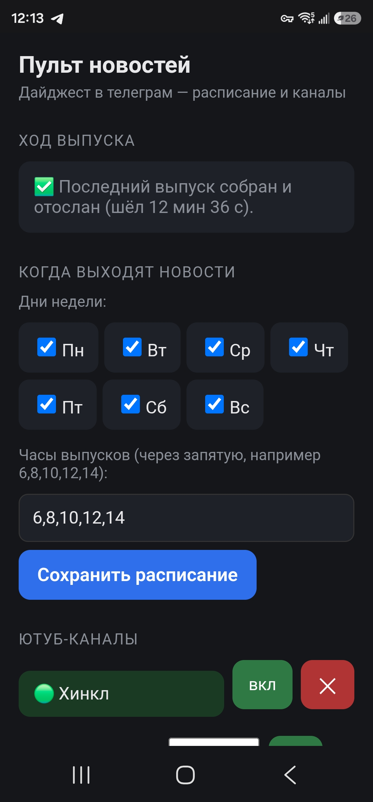
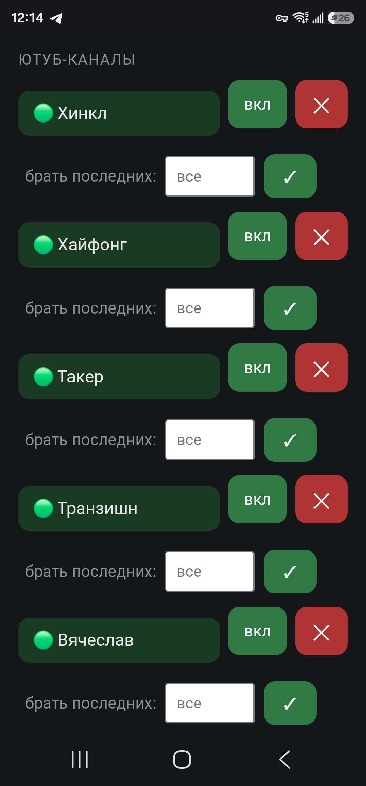
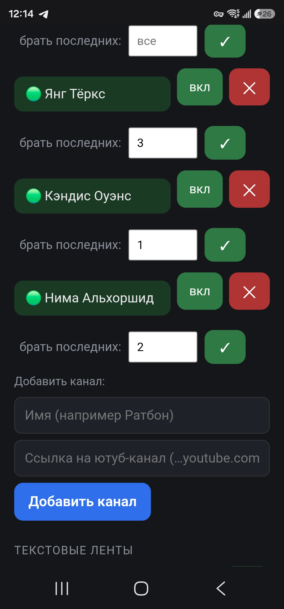
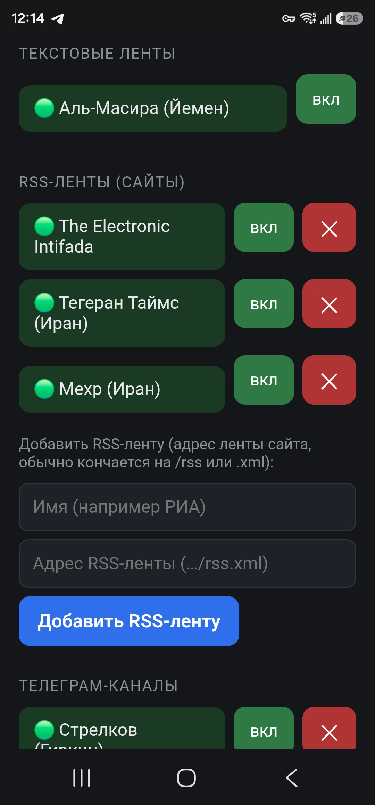
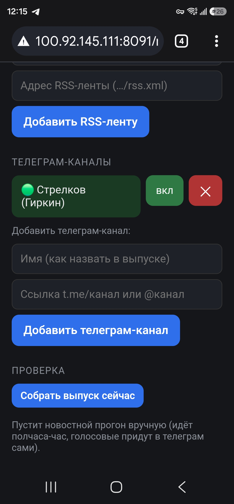
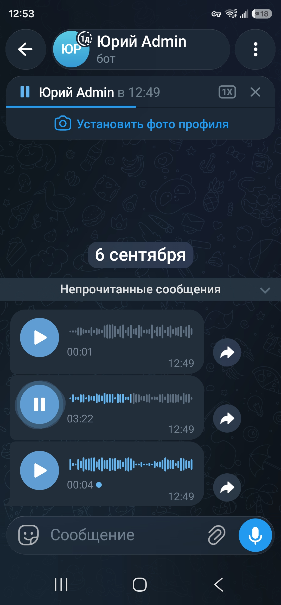

# TruckerNews

**Голосовой дайджест новостей для водителей-дальнобойщиков.**
*A hands-free voice news digest for long-haul truckers.*

Свежие новости приходят готовой озвучкой в Telegram — поэтому вы сможете слушать их в дороге, не
отрываясь от управления вашим траком. Никакого поиска, листания или чтения за рулём.

*Fresh news arrives as ready-to-play voice messages in Telegram — listen on
the road without taking your eyes off it. No searching, no scrolling, no
reading while driving.*

---

## Зачем это / Why

Водитель-дальнобойщик за рулём не должен искать новости, листать ленты и
читать статьи — это отнимает время и отвлекает от дороги. TruckerNews сделает это за вас:
он сам обойдет десятки источников, соберет все новости, рассортирует их и пришлет вам выжимку последних новостей прямо в ваш Telegram.

*Придумано и обкатано дальнобойщиком — для дальнобойщиков.*

## Что умеет / Features

- 📰 **Много источников сразу** — ютуб-обозреватели (звук ролика
  распознаётся в текст), **телеграм-каналы** (посты авторов, например
  Стрелков-Гиркин) и текстовые новостные ленты (RSS агентств) — всё
  сходится в один выпуск.
- 🔁 **Без повторов** — одно событие звучит **один раз**, собранное из всех
  источников, а не по пять раз одно и то же с разных каналов. Модель размечает каждую
  новость темой, сливает рассказы об одном событии и пишет по нему один
  связный пересказ.
- 🔊 **Играет само, без касаний.** Готовые голосовые сообщения приходят в
  Telegram и проигрываются **подряд, одно за другим** — не надо тыкать
  пальцем в каждое. Включил и слушаешь весь выпуск, руки на руле.
  (Технически: отправка через `sendVoice`, а не файлами — телеграм ставит
  их в единую очередь воспроизведения.)
- ✍️ **Безупречный русский язык.** Пересказ делает русская модель **T-Pro**,
  которую при сжатии в 4 бита (чтобы уместилась в одну видеокарту)
  **откалибровали на произведениях А. С. Пушкина** — эталоне русской речи.
  Благодаря этому сжатая модель говорит чище исходной: грамотный, живой
  русский, без ошибок и без чужих слов, которыми грешат обычные модели.
  Эта сжатая модель выложена в открытый доступ:
  **[Youri2/T-pro-it-1.0-int4-W4A16](https://huggingface.co/Youri2/T-pro-it-1.0-int4-W4A16)**
  на Hugging Face — можно взять готовую.
- 🎛 **Настройка с телефона на лету** — простой веб-пульт прямо из кабины:
  - добавляйте и убирайте **ютуб-каналы**, **телеграм-каналы** и **RSS-ленты**
    одним касанием;
  - включайте и выключайте любой источник, какой надоел;
  - задавайте для каждого ютуб-канала, сколько последних роликов брать;
  - меняйте дни и часы выхода новостей;
  - следите за ходом сборки — прогресс-бар и прогноз времени.
- 🌍 **Двуязычный (en-ru)** — берёт и англо-, и русскоязычные источники,
  пересказ на русском.

## Как выглядит пульт / Screenshots

Веб-пульт настроек — открывается в веб-браузере телефона прямо из кабины. Но часто он вам не понадобится, так как всё делается автоматически.

| | |
|---|---|
|  |  |
| **Ход выпуска и расписание** — когда собран последний выпуск, дни недели и часы выхода. | **Ютуб-каналы** — включить/выключить, удалить, задать сколько последних роликов брать. |
|  |  |
| **Добавление ютуб-канала** — имя и ссылка, одним касанием. | **Ленты** — текстовые (Аль-Масира) и добавляемые RSS-ленты (Electronic Intifada, Тегеран Таймс, Мехр). |
|  |  |
| **Телеграм-каналы и «Собрать сейчас»** — добавить канал автора, запустить выпуск вручную. | **Готовый выпуск в Telegram** — голосовые приходят и играют подряд, руки на руле. |

*The settings panel opens in the phone browser, right from the cab: release
progress and schedule, YouTube channels with per-channel limits, text/RSS
feeds, Telegram channels, a manual "build now" button — and the finished
digest arriving as back-to-back voice messages in Telegram.*

## Как это устроено / How it works

```
источники ──▶ ютуб (звук→текст) / телеграм-посты / статьи лент (RSS)
                         │
                         ▼
             пересказ каждого куска  ──▶  модель T-Pro (локальный vLLM)
                         │
                         ▼
   сведение по событиям:  тема каждому  ▶  группировка «одно событие»
                                          ▶  один рассказ из всех источников
                         │
                         ▼
             озвучка (Fish Speech TTS)  ──▶  Telegram (sendVoice)
```

Выпуск строится **по событиям**, а не по каналам:
1. каждой новости модель вешает короткую тему;
2. новости об одном событии сходятся в группу, важное — вперёд;
3. на каждую группу — один связный рассказ из всех источников сразу.

Так одно событие звучит один раз, а не повторяется по каждому каналу.

## Два вида лент: RSS и «текстовые» / RSS vs. scraped feeds

Новостные сайты в дайджесте бывают двух видов, и разница только в **одном**:
есть ли у сайта готовый «список новостей для машин».

- **RSS-ленты.** Сайт сам отдаёт **готовый ровный список свежих статей**
  по особому адресу (обычно кончается на `/rss` или `.xml`). Программе
  остаётся забрать готовый список ссылок — ничего угадывать не нужно.
  Такие ленты можно **добавлять и убирать с телефона** одним касанием:
  вписал имя и адрес ленты — готово. Пример в комплекте: The Electronic
  Intifada, Tehran Times, Mehr.
- **«Текстовые» ленты (соскабливание).** У некоторых сайтов RSS нет вовсе.
  Тогда программа читает новости **прямо с живой страницы сайта**, как
  человек глазами: качает главную, по заранее прописанному в коде шаблону
  выхватывает ссылки на статьи, заходит в каждую и вытаскивает текст,
  отбрасывая служебные «шапки». Для каждого такого сайта нужен **свой
  кусок кода**, поэтому их **нельзя добавлять/убирать с телефона** — они
  вшиты в программу и только включаются/выключаются. Пример в комплекте:
  Al-Masirah (Йемен) — у сайта нет RSS, сертификат «кривой» (приходится
  обходить проверку), а ссылки на статьи ведут вообще на другой их домен;
  всё это учтено в коде разбора именно этого сайта.

Вывод для настройки: **если у сайта есть RSS — добавляйте его как
RSS-ленту, это делается с телефона и без кода.** Собственный «соскабливающий»
разбор нужен только для сайтов без RSS.

*News sites here come in two kinds; the only real difference is whether the
site publishes a machine-readable list of its articles.*

- ***RSS feeds.*** *The site itself serves a ready-made list of fresh
  articles at a dedicated address (usually ending in `/rss` or `.xml`). The
  program just grabs that list — nothing to guess. These can be **added and
  removed right from your phone**: type a name and the feed URL, done.*
- ***"Scraped" feeds.*** *Some sites have no RSS at all. Then the program
  reads the news **straight from the live web page** — downloads the
  homepage, pulls out article links by a pattern hard-coded for that site,
  opens each one and extracts the body, dropping boilerplate headers. Each
  such site needs **its own bit of code**, so these **can't be added/removed
  from the phone** — they are built in and can only be toggled on/off. The
  bundled example, Al-Masirah, has no RSS, a broken TLS certificate (so cert
  checking is bypassed), and article links pointing to a different domain —
  all handled by code written specifically for that site.*

*Rule of thumb: **if a site has RSS, add it as an RSS feed — no code, done
from the phone.** A custom scraper is only needed for sites without RSS.*

## Требования к железу / Hardware

Проект рассчитан на самостоятельный хостинг с локальной видеокартой —
всё крутится на вашем компьютере, без облака.

- 🖥 **Видеокарта NVIDIA — главное требование.** Модель пересказа T-Pro в
  4 битах занимает ~18 ГБ видеопамяти, плюс расшифровка роликов (Whisper)
  на той же карте — вместе примерно **24–27 ГБ**. Практичный минимум —
  **видеокарта с 24 ГБ** (RTX 3090 / 4090). Оригинал собран на
  **RTX 5090 (32 ГБ)**. На карте поменьше — берите модель пересказа полегче
  или ведите расшифровку роликов на процессоре (медленнее).
- 🧠 **Оперативная память:** от 16 ГБ (комфортно — 32 ГБ).
- 💾 **Диск:** ~20 ГБ под модель (int4) плюс место под временные аудио.
- ⚙️ **Процессор:** любой современный; если расшифровка идёт на нём —
  чем мощнее, тем быстрее.
- 🐧 **ОС:** Linux (обкатано на Ubuntu). Python 3.11+.
- 🌐 **Интернет** — для источников новостей и Telegram.

*Без мощной видеокарты тоже можно — если взять модель пересказа и
расшифровку полегче или запускать на процессоре, — но выпуск будет
собираться заметно дольше.*

## Что нужно для запуска / Requirements

Это **референсная реализация под самостоятельный хостинг** — она рассчитана
на свои локальные сервисы, а не на облако. Чтобы поднять у себя, понадобятся:

- **Python 3.11+** (только стандартная библиотека для самих скриптов).
- **Модель пересказа** с OpenAI-совместимым API. В оригинале —
  **[T-Pro-it-1.0, сжатая в int4 (калибровка на Пушкине)](https://huggingface.co/Youri2/T-pro-it-1.0-int4-W4A16)**,
  запущенная через [vLLM](https://github.com/vllm-project/vllm). Модель
  выложена и готова к скачиванию. Подойдёт и любая другая с хорошим
  русским — адрес задаётся в настройках.
- **Озвучка (Fish Speech TTS)** — превращает готовый пересказ в голос. В
  оригинале — [Fish Speech](https://github.com/fishaudio/fish-speech)
  (свой, локальный, бесплатный); можно заменить на любой движок озвучки,
  что отдаёт голосовой файл.
- **[yt-dlp](https://github.com/yt-dlp/yt-dlp)** — скачивание аудио с ютуба.
- **[faster-whisper](https://github.com/SYSTRAN/faster-whisper) / transformers Whisper** — расшифровка роликов.
- **Telegram-бот** — создать у [@BotFather](https://t.me/BotFather), взять токен.

Проект вырос из личной установки автора (одна рабочая станция + одна
видеокарта), поэтому пути и адреса сервисов вынесены в настройки — подгоните
под свою машину.

## Установка по шагам / Step-by-step install

Всё ставится на Linux (обкатано на Ubuntu). Команды примерные — подгоните
под свою систему.

**0. Взять сам проект**
```bash
git clone https://github.com/Youri2026/TruckerNews.git
cd TruckerNews
```

**1. Python**
Нужен Python 3.11+ (в Ubuntu: `sudo apt install python3 python3-pip`).
Самим скриптам проекта хватает стандартной библиотеки — под них ставить
ничего не надо. Библиотеки ниже нужны для сервисов озвучки и распознавания.

**2. Модель пересказа — T-Pro + vLLM**
- Движок [vLLM](https://github.com/vllm-project/vllm): `pip install vllm`.
- Модель (готовая, сжата в int4, чистый русский от калибровки на Пушкине):
  **[Youri2/T-pro-it-1.0-int4-W4A16](https://huggingface.co/Youri2/T-pro-it-1.0-int4-W4A16)**
  на Hugging Face. Вручную качать не обязательно — vLLM скачает сам при
  первом запуске.
- Поднять как OpenAI-совместимый сервер (пример, порт 8002):
  ```bash
  vllm serve Youri2/T-pro-it-1.0-int4-W4A16 --port 8002
  ```
  Этот адрес (`http://127.0.0.1:8002`) впишите в начало `digest-news-en-ru.py`.
  Подойдёт и любая другая модель с хорошим русским — лишь бы отдавала
  OpenAI-совместимый API.

**3. Озвучка — Fish Speech**
- Скачать и поставить по инструкции их репозитория:
  **[github.com/fishaudio/fish-speech](https://github.com/fishaudio/fish-speech)**.
  Это отдельный локальный бесплатный сервис — на вход текст, на выход
  голосовой файл.
- **Про голос `adam`.** Fish умеет **клонировать голос по короткому образцу**
  (несколько секунд записи). В настройке проекта голос назван `adam` — это
  **личный голос автора**, у вас его нет. Запишите свой образец, заведите в
  Fish под своим именем и **поставьте это имя** в `digest-news-en-ru.py`
  (переменная `VOICE_PLAIN`).
- Fish можно заменить на **любой другой движок озвучки**, лишь бы отдавал
  звуковой файл.

**4. Скачивание и расшифровка роликов**
- [yt-dlp](https://github.com/yt-dlp/yt-dlp) — качает звук с ютуба:
  `pip install yt-dlp` (или готовый файл со страницы релизов).
- [faster-whisper](https://github.com/SYSTRAN/faster-whisper) — распознаёт
  речь в текст: `pip install faster-whisper` (можно и обычный
  [Whisper](https://github.com/openai/whisper)).

**5. Telegram-бот**
- Написать **[@BotFather](https://t.me/BotFather)** → создать бота → взять
  **токен**.
- Узнать свой **chat_id** (например, через **[@userinfobot](https://t.me/userinfobot)**)
  — это адрес, куда бот будет слать выпуски.
- И токен, и chat_id впишите в `telegram.json` (см. следующий раздел).

*In short: `git clone` this repo; Python 3.11+; serve the summariser model
with [vLLM](https://github.com/vllm-project/vllm) (the ready int4 model is
[Youri2/T-pro-it-1.0-int4-W4A16](https://huggingface.co/Youri2/T-pro-it-1.0-int4-W4A16));
install [Fish Speech](https://github.com/fishaudio/fish-speech) for TTS and
set your own cloned voice (the `adam` name in the config is the author's own
voice — replace it); `pip install yt-dlp faster-whisper`; create a Telegram
bot via [@BotFather](https://t.me/BotFather) and grab its token + your
chat_id. Then fill in the settings below.*

## Настройка / Setup

1. Скопируйте примеры настроек и впишите свои значения:
   ```bash
   cp config.example.json config.json
   cp telegram.example.json telegram.json
   ```
   - `telegram.json` — токен вашего бота и chat_id (**никому не показывайте**).
   - `config.json` — список ютуб-каналов и включённые ленты.
2. Укажите адреса своих сервисов (модель пересказа, TTS) в начале
   `digest-news-en-ru.py`, а также имя своего голоса в `VOICE_PLAIN`
   (по умолчанию стоит `adam` — голос автора, поставьте свой).
3. Запустите сборку выпуска вручную для проверки:
   ```bash
   python3 digest-news-en-ru.py
   ```
4. Поставьте на расписание (cron) и/или поднимите веб-пульт:
   ```bash
   python3 remote-news.py     # веб-пульт настроек, по умолчанию порт 8091
   ```

### Вещание в публичный канал (по желанию) / Public channel (optional)

По умолчанию выпуск приходит только вам в личку. Если хотите **раздавать
новости публично**, можно слать их ещё и в телеграм-канал — тогда рассылку
подписчикам делает сам Telegram, а ваш компьютер собирает выпуск **один раз**
независимо от числа слушателей.

1. Создайте телеграм-канал и добавьте своего бота в его **администраторы**
   с правом «Публикация сообщений».
2. В `telegram.json` укажите канал и включите режим:
   ```json
   { "token": "...", "chat_id": "...",
     "channel": "@ваш_канал", "channel_вкл": true }
   ```
   Выпуск будет приходить и вам в личку, и в канал. Чтобы выключить —
   поставьте `"channel_вкл": false` (или уберите строку `channel`).

*Note: publishing to a public channel makes you a publisher — you become
responsible for accuracy and for the editorial slant of your chosen sources.
Check what is legal to rebroadcast in your country.*

## Нужна помощь? / Stuck?

Если технические шаги кажутся вам слишком сложными — не беда. Поставьте себе
**[Claude Desktop](https://claude.ai/download)** и откройте этот проект в нём.
С моделью **Opus 4.8** можно прямо словами, по-русски, попросить помочь:
разобрать код, поставить нужные программы и **подогнать проект под ваше
железо** (другая видеокарта, другая модель пересказа, другой голос). ИИ
объяснит по шагам и сам внесёт правки — программистом быть не обязательно.
Собственно, и я — не профессиональный программист.

*Not a programmer? Install [Claude Desktop](https://claude.ai/download) and
open this project in it — with **Opus 4.8** you can ask, in plain language, to
explain the code, install what's needed, and **adapt the project to your own
hardware** (different GPU, different summariser model, different voice). This
whole project was built exactly that way.*

## Безопасность / Security

- **Токен Telegram-бота — секрет.** Не коммитьте `telegram.json` (он в
  `.gitignore`). По токену чужой человек сможет писать от имени вашего бота.
- Веб-пульт не имеет авторизации — держите его только в закрытой личной сети
  (например, [Tailscale](https://tailscale.com)), **не** открывайте в интернет.

## Лицензия / License

[Unlicense](LICENSE) — общественное достояние: берите, пользуйтесь, меняйте как угодно; упоминание авторства не требуется.

---

*TruckerNews — новости в кабину, без повторов и без отрыва от дороги.*
